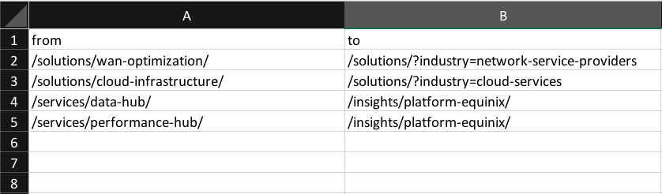
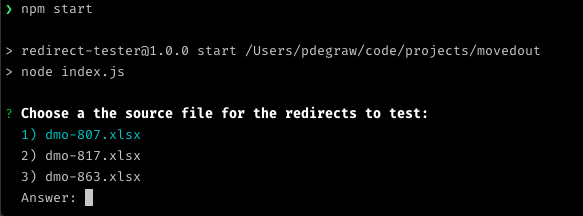
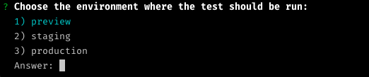

# Redirect Tester

A Node.js script that tests a list of URLs from a spreadsheet and generates a PDF report.

## Setup

1. clone the repository
2. install [Node JS](https://nodejs.org/en/)
3. run `npm install`
4. set up paths
    1. Redirects: run `echo 'redirects_path=/Path/to/your/redirects' >> .env` where the path you will be using is where your redirect spreadsheets will live
    2. Reports: run `echo 'reports_path=/Path/to/your/redirects/reports' >> .env` where the path you will be using is where your redirect reports will be generated
    3. Environments: run `echo 'environments=dev,staging,production' >> .env` where the values are your environment names
    4. Domains - Production: run `echo 'domains=https://site.com,https://site.fr,https://site.co.uk' >> .env` where the values are any production domains you need to test the redirects on
    5. Domains - other: run `echo 'domains_staging=https://staging.site.com,https://staging.site.fr,https://staging.site.co.uk' >> .env` where the values are any other environment domains you need to test the redirects on

## Usage

### Configure the input file

The script uses a spreadsheet (.xlsx) to load the data. It will skip the first row as most of the time it is a header row.

Requirements

- Column A is the "redirected from" URL
- Column B is the "redirected to" URL
- all URLs should be the pathname only
- remove any spaces at the end or beginning of the URL

### Generating a report

1. From the command line, run `npm start`

2. Select the input file

3. Select the environment
